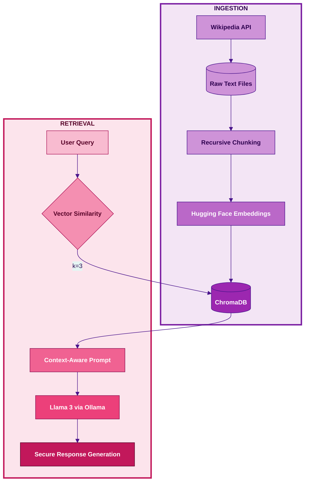

---

# ⚛️ Secure RAG: Local Nuclear Weapons Pipeline

A modular, local-first Retrieval-Augmented Generation (RAG) system designed for secure analysis of international nuclear weapons. This project demonstrates how to handle sensitive data using Llama 3 and ChromaDB without relying on external cloud APIs.

---

### 🎯 Task Objective
This pipeline is specifically built to process and retrieve factual information from wikipedia documents of 5 countries (USA, Russia, China, UK and Pakistan). 
By running entirely on local hardware, it ensures:

- **Data Privacy:** The documents never leave the computer machine.
- **Air-Gapped Performance:** Operates 100% offline once all documents are loaded.
- **Fact-based Retrieval:** Uses vector embeddings to find the exact technical context through semantic similarity, reducing model hallucinations.

### 🚀 Quick Features: 
- **Source Data:** Nuclear weapon history of 5 countries (Wikipedia datasets).
- **RAG Framework:** LangChain for linking retrieval and generation.
- **Vector Store:** ChromaDB (Local-first architecture for secure handling).
- **Embedding Model:** Hugging Face (sentence-transformers) running locally.
- **LLM Model:** Llama3 (via Ollama)
- **Execution Environment:** 100% local deployment to ensure data privacy and zero API costs.

### 📊 System Workflow: 

### 🛠️ Step-by-Step Implementation

#### Phase 1: Ingestion Pipeline (Pre-processing) 
- **Automated Data Sourcing:** Used the Wikipedia API to grab real-world factual data on nuclear weapons.
- **Recursive Chunking:** Implemented Recursive Character Text Splitter with a 800 character limit. This text splitter offers multiple separators to make sure the sentences don't cut midway, retaining semantic meaning.
- **Hugging Face Embeddings:** Used sentence-transformer model that converted text passage into "384-dimensional vectors".
- **Vector Storage:** Stored the vector embeddings in ChromaDB vector store using HNSW Cosine Similarity to ensure the most mathematically similar documents are found during retrieval phase (search).

#### Phase 2: Retrieval Pipeline (Retrieval & Generation) 
- **Contextual Retrieval:** Performed a similarity search to extract the top 3 (k=3) most relevant text chunks from the local vector store.
- **Context-Aware Prompt:** Constructed a dynamic prompt that combines the retrieved document chunks with the user's original query. This component uses a 'SystemMessage' to instruct the AI to act as a factual research assistant. The model is instructed in the prompt to say, *"I do not have enough information based on the documents provided."*, if the answer is not available in the source documents. This prevents the LLM from hallucinating.
- **Deterministic Inference:** Set the temperature to 0 and a fixed seed (25) to ensure 100% reproducible and consistent outputs. 
- **Secure Response Generation:** Powered by Llama 3 running locally via Ollama, making sure the data remains entirely on the host machine throughout the generation process. 

### ⚡ Execution Guide
1. Install dependencies: `pip install -r requirements.txt`
2. Ensure Ollama is running with: `ollama run llama3`
3. Run ingestion: `python rag_ingestion_pipeline.py`
4. Run retrieval: `python rag_retrieval_pipeline.py`
